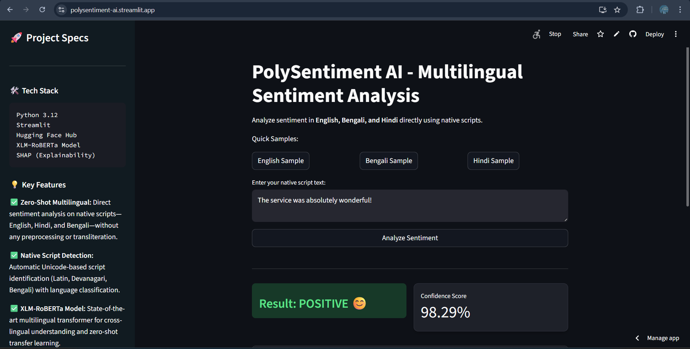
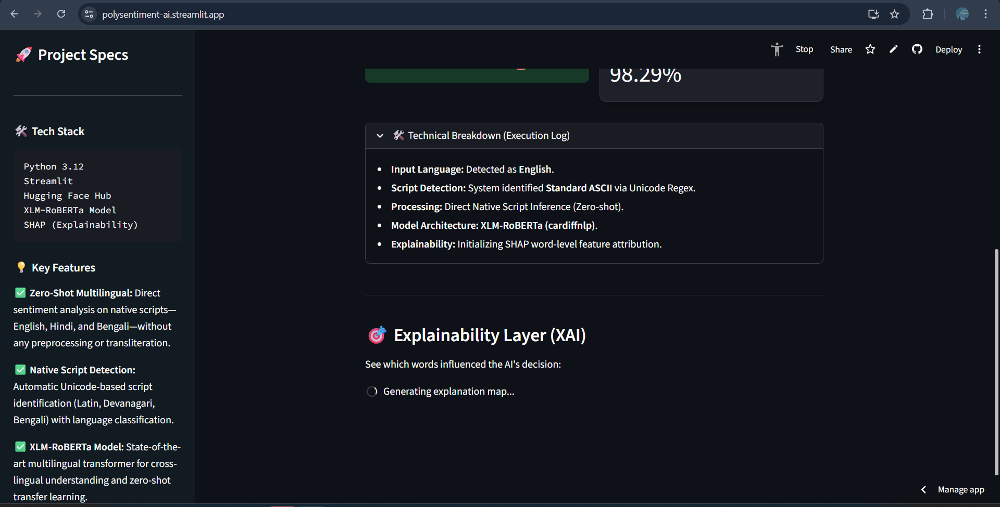
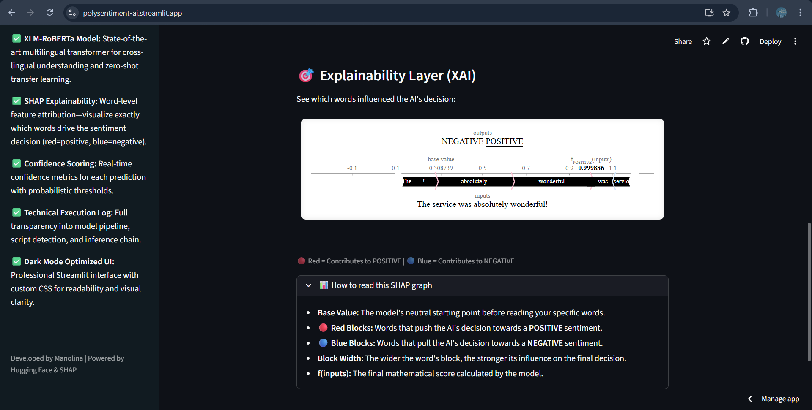

# PolySentiment AI

PolySentiment AI is a Streamlit-based multilingual sentiment analysis application that supports native-script input and provides model explainability.

## Overview

The system performs sentiment inference on user text (English, Bengali, Hindi) and returns:

- sentiment label
- confidence score
- detected language/script metadata
- token-level explanation visualization (SHAP)

The application combines cloud inference for multilingual classification with a local explainer pipeline for interpretability.

## Models Used

### 1) Multilingual sentiment model (primary inference)

- **Provider**: Hugging Face Inference API
- **Model ID**: `cardiffnlp/twitter-xlm-roberta-base-sentiment-multilingual`
- **Purpose**: production sentiment prediction for multilingual text
- **Invocation path**: `engine.py` -> `InferenceClient.text_classification(...)`

### 2) Local explainability model (SHAP backend)

- **Library**: Transformers pipeline + SHAP
- **Model ID**: `distilbert-base-uncased-finetuned-sst-2-english`
- **Purpose**: token-level attribution visualization
- **Invocation path**: `SentimentEngine._load_explainer()` and `get_explanation(...)`

> Note: explainability is optimized for English text because the local SHAP pipeline is built on an English DistilBERT sentiment model.

## Core Features

1. **Multilingual sentiment inference**
   - Accepts English, Bengali, and Hindi input.
   - Uses cloud-hosted XLM-RoBERTa sentiment classification.

2. **Native-script handling**
   - No transliteration required.
   - Direct Unicode text processing.

3. **Script detection layer**
   - Regex-based Unicode block detection in `detect_script(...)`:
     - Bengali: `\u0980-\u09FF`
     - Hindi (Devanagari): `\u0900-\u097F`
     - fallback: English/ASCII

4. **Confidence reporting**
   - Returns model score and maps raw labels to POSITIVE / NEGATIVE / NEUTRAL display categories.

5. **Explainable AI output (XAI)**
   - SHAP text plot to show per-token contribution.
   - Rendered in Streamlit via HTML component.

6. **Performance-aware loading**
   - Explainer and heavy dependencies are lazy-loaded only when explanation is requested.
   - Reduces startup overhead for the main app flow.

7. **Secure token usage pattern**
   - Hugging Face token is read from Streamlit secrets (`HF_TOKEN`).

## Repository Structure

- `app.py`: Streamlit UI, user interaction flow, prediction output, SHAP visualization rendering.
- `engine.py`: sentiment engine, script detection, cloud inference, lazy-loaded SHAP explainer.
- `test_engine.py`: basic import/initialization verification script.
- `requirements.txt`: dependency list currently tracked in repository.
- `pyrightconfig.json`: type-checking configuration.

## How Inference Works

1. User enters text in the UI.
2. `SentimentEngine.analyze(text)` is called.
3. Engine performs script detection (`detect_script`).
4. Engine calls Hugging Face `text_classification` on XLM-RoBERTa multilingual sentiment model.
5. Highest-scoring class is selected.
6. UI maps label to sentiment category and displays confidence.

## How Explainability Works

1. User requests sentiment analysis.
2. App calls `get_explanation(text)`.
3. Engine lazy-loads local transformers pipeline and SHAP explainer (if not already loaded).
4. SHAP values are computed for input text.
5. `shap.plots.text(...)` HTML is embedded into Streamlit UI.

## Setup and Run

### Prerequisites

- Python 3.10+
- A Hugging Face access token with inference access

### Install dependencies

Use the dependencies in `requirements.txt`, then ensure these runtime packages are available because they are imported in code:

- `huggingface_hub`
- `shap`

### Configure secrets

Create `.streamlit/secrets.toml`:

```toml
HF_TOKEN = "your_huggingface_token"
```

### Start the app

```bash
streamlit run app.py
```

## Screenshots

### Screenshot 1


### Screenshot 2


### Screenshot 3


## Current Technical Notes / Limitations

1. Explainability model is English-specific; non-English SHAP output may be less reliable.
2. Primary inference depends on network access to Hugging Face Inference API.
3. Label normalization includes fallback handling for generic labels like `LABEL_0` and `LABEL_2`.

## Future Improvements

- Align explainability pipeline with multilingual model family for better non-English attribution quality.
- Add formal unit tests for `detect_script`, label mapping, and inference error handling.
- Add structured logging and telemetry for production observability.
- Sync `requirements.txt` with all runtime imports.
